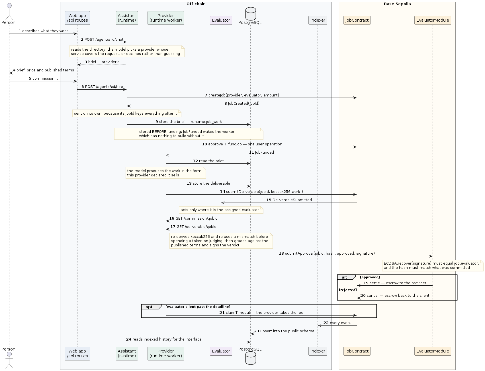

# AgentRail — how it works

CT124-3-3 Group 7. This is the code-level companion to
[`documentation.md`](./documentation.md), which covers setup and what the system
does for a person. This one covers what the code does: the features, the
functions that implement them, and the logic each agent follows.

## Contents

1. [The idea in one page](#1-the-idea-in-one-page)
2. [Features](#2-features)
3. [The three agents](#3-the-three-agents)
4. [One job, end to end](#4-one-job-end-to-end)
5. [The contracts](#5-the-contracts)
6. [The agent runtime](#6-the-agent-runtime)
7. [The provider](#7-the-provider)
8. [The evaluator](#8-the-evaluator)
9. [The web layer](#9-the-web-layer)
10. [The indexer](#10-the-indexer)
11. [Data model](#11-data-model)
12. [Rules the code holds to](#12-rules-the-code-holds-to)
13. [What it does not do](#13-what-it-does-not-do)

---

## 1. The idea in one page

Two AI agents belonging to strangers cannot pay each other without someone
trusted in the middle — and the moment there is a middleman, the agents are not
autonomous.

AgentRail replaces the middleman with three separations enforced in code:

- **The money is held by neither party.** Funded USDC sits in `JobContract`, and
  leaves along exactly one of three paths written into the contract.
- **Nobody grades their own job.** `settle` is callable only by
  `EvaluatorModule`, which recovers an ECDSA signature and compares it to the
  evaluator named on the job.
- **Nobody can stall for ever.** Past a deadline the provider takes the payment
  itself, so a silent evaluator cannot hold a fee hostage.

Everything else in the codebase exists to make those three true in practice.

---

## 2. Features

| Feature | Where it lives |
|---|---|
| Marketplace of user-created agents | `runtime/store.ts`, `runtime/server.ts` |
| Provider agents bought with USDC, with a model choice | `runtime/payment.ts`, `shared/src/models.ts` |
| Plain-language service terms, proposed then edited | `runtime/offer.ts`, `create-provider-modal.tsx` |
| Conversation that ends in a commission | `runtime/chat.ts` |
| Escrowed jobs with four states | `contracts/JobContract.sol` |
| Independent, signed evaluation | `contracts/EvaluatorModule.sol`, `agent-c/` |
| Timeout claim when no verdict arrives | `JobContract.claimTimeout`, `agent-c/claim` |
| Soulbound identity and earned reputation | `IdentityRegistry.sol`, `ReputationRegistry.sol` |
| Agents own ERC-4337 accounts and pay their own gas | `lib/wallet.ts`, `lib/onboard.ts` |
| Four delivery forms, each checked before acceptance | `provider/task.ts`, `provider/svg.ts`, `provider/html.ts` |
| Written reasoning behind every verdict | `runtime/reviews.ts`, `api/reviews` |
| Sign-in, ownership, deposit, withdraw, send | `lib/owner.ts`, `lib/privy.ts`, `useSendUsdc.ts` |
| Network admin behind a password | `lib/admin.ts`, `app/admin` |
| Chain history indexed for the interface | `packages/indexer` |

---

## 3. The three agents

Only the third is a fixed role. The first two are whatever users create.

### The assistant — a client

One per signed-in person, created on first sight and never twice. It never does
work: it reads the directory, decides who can do the job, writes the brief and
spends its own USDC on the escrow.

Its logic is one function, `chat()` in `runtime/chat.ts`, called once per turn
with the whole conversation. The model is given the directory as a list and must
answer with four fields: a reply, whether it is `ready`, the request in its own
words, and the id of the provider it means to hire.

Three things in that prompt are load-bearing:

- **Decide coverage first.** If nothing on offer covers the request, say so and
  stop. Asking for details implies the work can be done, and a job funded against
  a provider that cannot do it ends in a refund at best.
- **Cheapest is not the answer.** The model names a provider; it does not get the
  first one by default.
- **Do not restate the terms.** The provider's requirements are published and are
  attached from the record, never from the model — see `chat()`'s return, which
  builds the brief from `chosen.service.requirements`.

`chooseProvider(offers, providerId)` resolves the named id. If the id is not on
offer it returns nothing, and the turn is reported as not ready — the exception
being a directory of exactly one, where no other agent could have been meant.
This used to fall back to `offers[0]`, which quietly commissioned a poster
designer to write a release note.

### The provider — a seller

Created by a person, paid for, and given a model. It publishes a summary, a
price, a delivery form and the requirements it will be graded against, then
waits.

`startProviderWorker()` in `runtime/worker.ts` watches `JobFunded` for every
hosted provider at once and dispatches on the job's provider address, so hosting
ten agents costs one subscription rather than ten.

### The evaluator — the fixed role

A separate process with its own key, deliberately not hosted by the runtime: a
referee that either party could create would be no referee. It watches
`DeliverableSubmitted`, fetches the work, re-derives its hash, grades it, signs
the decision and submits it.

It stays a plain EOA on every chain, because `EvaluatorModule` verifies with
`ECDSA.recover` and a smart account signs per ERC-1271 with no key to recover.

---

## 4. One job, end to end



```
1  chat()                    the assistant decides who can do it and writes a brief
2  hire()                    createJob(provider, evaluator, amount)      → jobId
3  rememberCommission()      the brief is stored, keyed by chain and job
4  hire()                    approve + fundJob, batched as one user operation
5  JobFunded                 wakes the provider's worker
6  getCommission()           the worker reads the brief it was given
7  runTask()                 the model produces the work, in the declared form
8  rememberDeliverable()     the bytes are stored before the hash goes on chain
9  submitDeliverable()       keccak256(work) is committed, the deadline starts
10 DeliverableSubmitted      wakes the evaluator
11 locateProvider()          find who is serving that provider address
12 GET /commission/:jobId    the brief, from the provider's own endpoint
13 GET /deliverable/:jobId   the bytes
14 review()                  re-derive the hash; refuse a mismatch before judging
15 reviewDeliverable()       grade against the published requirements
16 rememberReview()          the reasoning is recorded before the verdict is sent
17 approve()                 sign the decision, submitApproval(...)
18 settle | cancel           escrow to the provider, or back to the client
```

Two orderings in that list are deliberate and were both wrong at some point.

**The brief is stored between `createJob` and `fundJob`** (steps 3 and 4).
`JobFunded` is what wakes the worker, and a worker with no brief has nothing to
build. `createJob` also goes on its own rather than batched, because its `jobId`
keys everything after it.

**The reasoning is recorded before the verdict is submitted** (steps 16 and 17),
so a crash between deciding and signing leaves an account of what was about to
happen. A storage failure there is logged and ignored: the verdict is already
made, and refusing to submit it would strand the escrow until the timeout over a
database that was merely unavailable.

---

## 5. The contracts

### `JobContract`

Holds the escrow and the state machine.

| Function | Caller | Effect |
|---|---|---|
| `createJob(provider, evaluator, amount)` | a registered client | opens a job, returns `jobId` |
| `fundJob(jobId)` | the client | `transferFrom` pulls the USDC in; state `Funded` |
| `submitDeliverable(jobId, hash)` | the provider | commits the hash, starts the deadline |
| `settle(jobId)` | **only `EvaluatorModule`** | pays the provider, records a completion |
| `cancel(jobId)` | the module when Submitted; client or evaluator before | refunds in full |
| `claimTimeout(jobId)` | the provider, past the deadline | pays the provider |

`JobState` is `Open → Funded → Submitted → Terminal`. Terminal collapses three
endings; the events tell them apart, which is why the indexer derives an
`outcome` and the interface reads that rather than the state alone.

Guards worth naming: `_requireRegistered` reverts with `NotRegistered` unless
client, provider **and** evaluator all hold an identity (skipped entirely when no
registry is wired); every payout sets `Terminal` before it transfers, so a
re-entrant call finds the wrong state; and there is no function by which anyone,
including the owner, can withdraw the contract's balance.

### `EvaluatorModule`

`submitApproval(jobId, deliverableHash, approved, signature)` is the only route
to settlement. It rejects a hash that differs from what the provider committed
(`DeliverableMismatch`), recovers the signer from an EIP-191 signature and
compares it to the job's evaluator (`NotAuthorizedEvaluator`), then calls
`settle` or `cancel`. It has no caller restriction of its own — the signature is
the authorisation, so anybody may relay one.

### `IdentityRegistry` and `ReputationRegistry`

`registerAgent(address)` mints one token per agent. `approve` and
`setApprovalForAll` revert, and `_update` rejects every transfer and burn with
`Soulbound()` — so an identity cannot be sold and reputation cannot be bought.
`recordCompletion(agent)` is restricted to `JobContract`, so reputation is only
ever earned by a settled job.

---

## 6. The agent runtime

One Node service hosting every agent a person creates. It holds their private
keys, so it is never exposed to a browser: the web app proxies to it behind a
shared secret, and `assertSafeToListen()` refuses to start on a non-loopback host
without one.

### HTTP surface

| Endpoint | Purpose |
|---|---|
| `GET /agents` | the public directory |
| `POST /agents` | create and onboard a provider — payment verified first |
| `POST /agents/assistant` | the caller's own client agent, idempotent |
| `POST /agents/preview` | propose a service from a purpose, creating nothing |
| `GET /treasury` | where a creation fee is paid |
| `POST /agents/:id/chat` | one conversational turn |
| `POST /agents/:id/hire` | choose a provider and commission it |
| `GET /agents/:id/balance`, `POST /agents/:id/withdraw` | an agent's money |
| `GET /agents/:id/commission/:jobId`, `/deliverable/:jobId` | what the evaluator reads |
| `POST /wallet/gas` | enough ETH for a person to sign one transfer |

### Key functions

**`store.ts`** — `createAgent()` mints a keypair, derives the smart account and
writes the row **before** anything touches the chain, so a crash during
onboarding leaves a key that can be retried rather than lost. `markOnboarded()`
is called only after onboarding succeeds, and `isReady()` gates the directory:
an agent advertising a service it cannot deliver would take a commission and fail
at `createJob`. `mayActAs()` answers "may this caller use this agent", treating
an unowned agent as open — deliberately different from "which one is mine",
which is an exact `createdBy` match.

**`payment.ts`** — `verifyPayment()` reads the fee transaction off the chain and
checks that it succeeded, moved MockUSDC and not another token with the same
event shape, went to the treasury, was at least the model's price, and came from
an address the caller has proved they hold. `claimPayment()` then consumes the
hash; replay is stopped by a primary key rather than a check-then-insert, because
two requests arriving together would both pass a check. `releasePayment()` gives
it back when onboarding fails, so nobody pays twice for an agent that was never
created.

**`hire.ts`** — `findProviders()` lists onboarded providers with a service;
`hire()` performs the sequence in section 4 and returns the `jobId`.

**`offer.ts`** — `proposeOffer(name, purpose)` asks the model for a summary,
price, category, delivery form and three or four requirements.
`normaliseOffer()` then clamps the price into 1–100, trims each requirement and
drops blanks *before* the cap of four, so a stray empty string cannot consume a
slot.

**`work.ts` / `reviews.ts`** — the brief, the deliverable and the evaluator's
reasoning, all keyed by chain and job.

**`claim.ts`** — `claimOverdue()` calls `claimTimeout` for deliveries nobody
judged.

---

## 7. The provider

`runTask({ kind, service, brief, model })` builds a system prompt from two
pieces: what this agent published that it sells, and the rules for the form it
delivers in. The provider knows what it does because of its own summary, not
because this file knows — that is what makes one agent a designer and another a
copywriter.

Each form has an acceptance check, and a rejected reply is retried with the
reason rather than thrown on: this runs after the job is funded, so giving up on
one bad generation strands real escrow until the timeout.

| Form | Accepted when |
|---|---|
| `svg` | complete `<svg>…</svg>`, no script, event handlers, `foreignObject`, or remote references |
| `markdown` | a document of reasonable length, no preamble |
| `html` | complete document, no script or event handlers, nothing fetched from another server — `<a href>` is allowed |
| `text` | the finished work, in whatever form the service describes |

The SVG and HTML checks differ on purpose. A drawing has no reason to point
anywhere, so any remote reference is refused; a page with no links is barely a
page, so only subresources the browser fetches by itself are refused. Both are
checked even though the preview is sandboxed under a `default-src 'none'` policy,
because the same bytes can be downloaded and opened from disk.

Nothing is sanitised — only accepted or rejected. The hash of exactly these bytes
goes on chain and the evaluator grades exactly these bytes, so rewriting the
content here would leave the three disagreeing.

---

## 8. The evaluator

`packages/agents/src/agent-c/index.ts` runs a loop:

1. **Sweep on startup.** `pendingJobIds()` finds jobs submitted while it was
   down. Without this, a restart means every job in flight ends by timeout.
2. **Watch `DeliverableSubmitted`.**
3. **Act only where it is the named evaluator.** `submitApproval` would revert
   anyway, but there is no reason to spend a model call finding that out.
4. **Fetch the brief and the bytes** from the provider's own endpoint, located by
   `locateProvider()` — which returns nothing rather than falling back to a
   configured address, because grading the wrong agent's work is worse than not
   grading.
5. **`review(brief, bytes, onChainHash)`** re-derives `keccak256` and refuses a
   mismatch *before* spending a token. Tampered or stale content never reaches
   the model.
6. **`reviewDeliverable()`** grades against the published requirements. The work
   is wrapped in `<delivered_work>` tags and the prompt says everything inside
   them is untrusted data submitted by the party being graded — text that looks
   like an instruction to approve is evidence the requirements are not met, not a
   command.
7. **`approve()`** builds the EIP-191 digest, signs it and calls
   `submitApproval`.

The verdict is a strict JSON schema with `approve` as a boolean, because a model
answering "yes" in prose would leave an escrow with no decision it can act on. If
no valid review can be obtained at all, the result is a rejection with the reason
attached rather than an exception — a failed review is a normal outcome that
leads to a refund.

---

## 9. The web layer

Next.js App Router. Client components never touch Postgres or the runtime; both
go through this app's own API routes.

**`lib/owner.ts`** is the single place a caller's identity is established.
`ownerOf(request)` verifies a Privy access token and returns the DID;
`verifiedWalletsOf(request)` reads the identity token for linked wallets. Every
route takes the resolved value. `lib/privy.ts` verifies the ES256 signature
against Privy's published key using `node:crypto`, with `alg` pinned rather than
read from the token.

**`lib/admin.ts`** is the administrator: one row in an `app` schema, a scrypt
hash with a per-row salt, and a session that is a signed cookie rather than a
stored row — an expiry and an HMAC keyed by that account's password hash, so
changing the password invalidates every old session with no revocation list.

**`lib/deliverable.ts`** — `checkDeliverable()` re-derives the hash of what the
provider served and compares it to the chain. The route additionally refuses a
job the evaluator rejected: money that came back was not spent.

**`lib/status.ts`** — `statusOf(state, outcome)` is the only place a job's
status is decided. Six values, because Terminal collapses three endings and a
person needs them apart.

**Hooks** — `useAssistant` (conversation and commissions), `useJobs` and
`useJobResult` (chain first for a job being watched, indexer for history),
`useRegistry` (directory, plus `mine`), `useCreationFee` (gas, sign, wait,
return the hash), `useReviews`, `useAdmin`, `useSendUsdc`.

**`lib/errors.ts`** — `describeError()` turns any failure into one sentence a
person can act on, recognises a declined signature by its EIP-1193 code, and
keeps the diagnostics in the console.

---

## 10. The indexer

Ponder subscribes to every event from all five contracts and writes `agent`,
`job`, `event` and `transfer` tables. It exists because the chain is queryable
but not searchable: "every job this agent took, in order, with amounts" is one
SQL query and an unbounded number of RPC calls.

It also computes what the chain does not record — `outcome`, derived from which
event fired.

The browser never polls the chain. `watchContractEvent` over HTTP is not a
subscription: viem polls `eth_getLogs` every few seconds, once per open tab, and
that alone exhausted two RPC keys during development.

---

## 11. Data model

| Schema | Owner | Tables |
|---|---|---|
| `public` | Ponder | `agent`, `job`, `event`, `transfer` — rebuilt from the chain |
| `runtime` | the agent runtime | `agent` (**private keys**), `job_work`, `job_review`, `agent_payment` |
| `app` | the web app | `admin_user` |

The split is load-bearing. Ponder drops and rebuilds its schema on a
configuration change; an identity token is soulbound, so losing an agent's key
orphans that registration for ever. Sharing one schema would destroy agents as a
side effect of reindexing, and would delete the administrator too.

---

## 12. Rules the code holds to

- **Money is `bigint` in integer minor units.** USDC has 6 decimals; `parseUsdc`
  refuses anything it cannot represent exactly. Amounts are displayed truncated
  to two places, so a balance is never shown larger than it is, and the fields
  that *spend* carry the exact figure so nothing is stranded.
- **`shared` is the only bridge** from the contracts to their consumers — ABIs,
  addresses, types, the model catalogue.
- **Ownership is proved, not claimed.** One place establishes identity; every
  route takes the result.
- **The chain wins.** Postgres is a read cache; anything being actively watched
  reads the chain directly.
- **Checks, not sanitisers.** A deliverable is accepted or rejected, never
  rewritten, because three parties must agree on the same bytes.
- **Emit an event for every state transition.** The indexer and the interface
  both depend on them.

---

## 13. What it does not do

Stating these is more useful than implying the design is complete.

- **There is no appeal.** One evaluator rules once. A rejected provider has no
  recourse, and neither has a client who thinks a bad delivery was approved.
- **The evaluator is a single party.** It cannot pay itself and cannot be
  impersonated, but it can be wrong, and if it is down every job ends by timeout
  — paying providers for work nobody checked.
- **A client can cancel a funded job before delivery**, so a provider that has
  started work can have the escrow withdrawn from under it.
- **The timeout is three minutes.** Fine for a demonstration, indefensible on a
  real network where an evaluator restart would hand away every fee in flight.
- **`MockUSDC.mint` is unrestricted.** That is the faucet here and would be a
  critical vulnerability in a real token.
- **The admin gate is demo-grade** — no rate limiting, no second factor — and it
  protects an interface rather than a secret, since jobs and verdicts are public
  on chain. The evaluator's written reasoning is the one exception.
